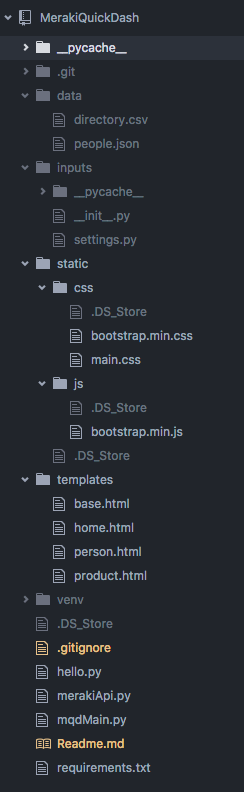

## Specific Meraki Dashlet

This repo is based on the https://github.com/rnplett/FlaskBareDash repo which covers off a step by step installation process for a VERY simple implementation. Reference that for a step by step installation procedure.

This repo takes it one step further to deploy a simple Meraki Network dashlet and introduces the idea of templates, style sheets and js to further simplify larger deployments.

Start the mqdMain.py app as follows:
```
For Windows:
>set FLASK_APP=mqdMain
>flask run

For all other systems:
FLASK_APP=mqdMain.py flask run
```

After you issue the above command you can now put the following url into your web browser to test the app:
http://127.0.0.1/hello
This is the "Hello World" page for this app.

<b>After Hello World</b> its time to do something more interesting. This happens when you can source data from one or more API's and then combine them in an interesting way that's specific to how your users want to see it.

In this case data is pulled from the Meraki Dashboard API and a local directory file. The network client data from the API and the directory entries are combined to indicate how many devices are represented by each active directory entry.

Here's a look at the <b>directory and file framework</b> that is used in the example:


As noted above the main flask file is mqdMain.py which is what you run to start the web service.

You'll notice the merakiApi.py file that contains all the functions used to call the Meraki API. These functions return the data to the main function for processing.

These two python files contain all the scripts required but there are a number of supporting files that are important to note in the directory tree.

<b>data</b> diretory:  is used to store data sources. Mostly these files are read/write and are used to store data between calls or from outside sources. This directory is not part of the repo and needs to be created after the repo is cloned.

<b>inputs</b> directory:  is for storing constants and data structures that are use case specific like credentials, certificates and other proprietary information. This directory is not part of the repo and needs to be created after the repo is cloned.

<b>static</b> directory:  contains js scripts and css data for the jinja2 templates.

<b>templates</b> directory:  is where the jinja2 templates are kept.

<b>venv</b> directory: this is the python virtual environment that is created as part of establishing this little app. It is also not part of the repo and will be specific to your implementation.
